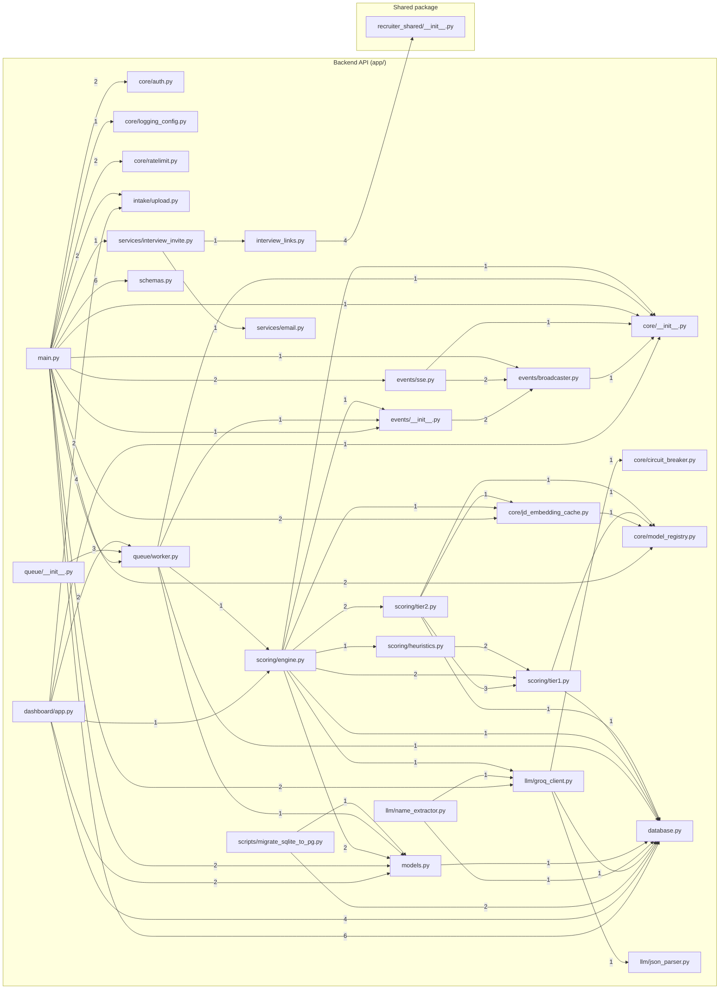
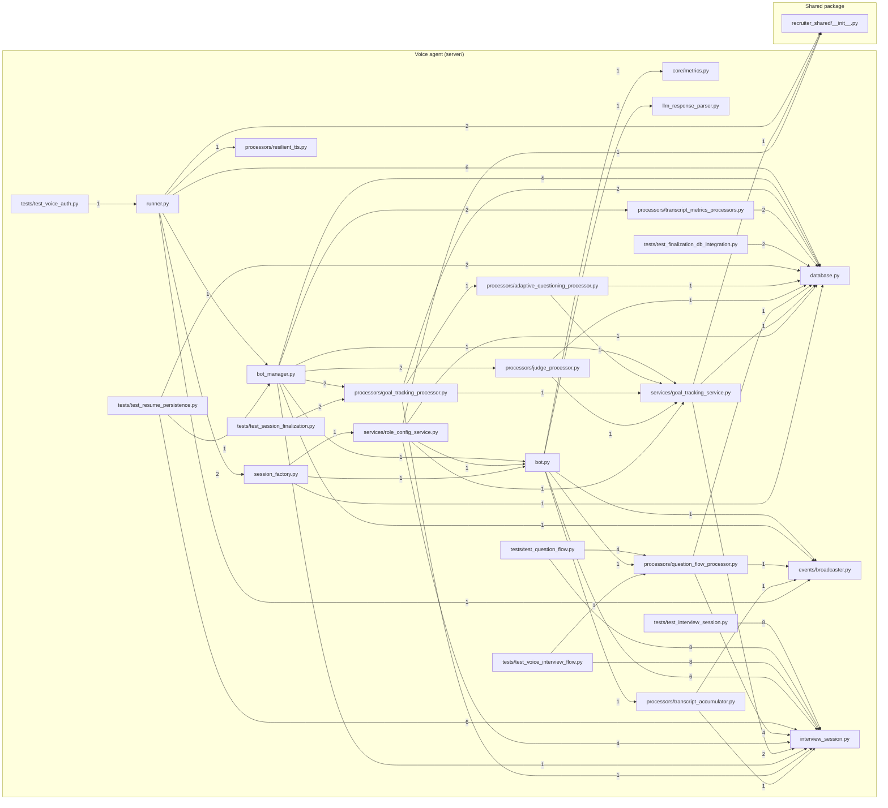
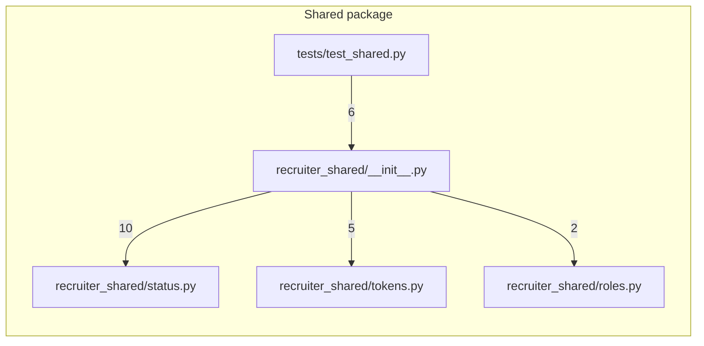

# Module dependency graph

_Auto-generated by `scripts/module_graph.py` — do not edit by hand; re-run to refresh._

Nodes are source files. An edge **A → B** means *A imports from B*; the number on the edge is the **weight** = how many names A imports from B (`from x import a, b` = 2, `import x` = 1, TS `import { a, b }` = 2). Only intra-project imports are shown (third-party/stdlib omitted).

**112 files** participate in **232 weighted edges**.

## 1. Package-level overview

Edges aggregated to directory level (cross-package only).

```mermaid
graph LR
  subgraph Frontend__frontend_src__["Frontend (frontend/src/)"]
    n0["frontend/src/app"]
    n1["frontend/src/app/admin"]
    n2["frontend/src/app/admin/candidates"]
    n3["frontend/src/app/admin/candidates/#91;candidateId#93;/interview"]
    n4["frontend/src/app/admin/dashboard"]
    n5["frontend/src/app/admin/jobs"]
    n6["frontend/src/app/applicant"]
    n7["frontend/src/app/applicant/#91;jobId#93;"]
    n8["frontend/src/app/applicant/#91;jobId#93;/apply"]
    n9["frontend/src/app/applicant/#91;jobId#93;/apply/success"]
    n10["frontend/src/app/interview/#91;token#93;"]
    n11["frontend/src/components"]
    n12["frontend/src/components/admin"]
    n13["frontend/src/components/candidates"]
    n14["frontend/src/components/job"]
    n15["frontend/src/components/layout"]
    n16["frontend/src/components/ui"]
    n17["frontend/src/hooks"]
    n18["frontend/src/lib"]
    n19["frontend/src/types"]
  end
  subgraph Backend_API__app__["Backend API (app/)"]
    n20["app"]
    n21["app/core"]
    n22["app/dashboard"]
    n23["app/events"]
    n24["app/intake"]
    n25["app/llm"]
    n26["app/queue"]
    n27["app/scoring"]
    n28["app/scripts"]
    n29["app/services"]
  end
  subgraph Shared_package["Shared package"]
    n30["packages/shared/recruiter_shared"]
    n31["packages/shared/tests"]
  end
  subgraph Voice_agent__server__["Voice agent (server/)"]
    n32["voice-agent/server"]
    n33["voice-agent/server/core"]
    n34["voice-agent/server/events"]
    n35["voice-agent/server/processors"]
    n36["voice-agent/server/services"]
    n37["voice-agent/server/tests"]
  end
  n37 -->|36| n32
  n12 -->|36| n16
  n35 -->|13| n32
  n17 -->|12| n18
  n17 -->|12| n19
  n13 -->|11| n16
  n20 -->|10| n21
  n32 -->|9| n35
  n36 -->|9| n32
  n18 -->|8| n19
  n37 -->|7| n35
  n13 -->|7| n18
  n2 -->|7| n16
  n22 -->|6| n20
  n31 -->|6| n30
  n16 -->|6| n18
  n27 -->|5| n21
  n27 -->|5| n20
  n12 -->|5| n19
  n12 -->|5| n13
  n14 -->|5| n16
  n2 -->|5| n12
  n20 -->|4| n30
  n20 -->|4| n26
  n20 -->|4| n23
  n13 -->|4| n19
  n5 -->|4| n17
  n28 -->|3| n20
  n32 -->|3| n34
  n35 -->|3| n36
  n10 -->|3| n18
  n2 -->|3| n13
  n2 -->|3| n17
  n20 -->|2| n24
  n20 -->|2| n25
  n22 -->|2| n24
  n22 -->|2| n26
  n23 -->|2| n21
  n25 -->|2| n20
  n26 -->|2| n20
  n32 -->|2| n36
  n32 -->|2| n30
  n35 -->|2| n34
  n36 -->|2| n30
  n8 -->|2| n17
  n2 -->|2| n19
  n2 -->|2| n18
  n4 -->|2| n16
  n5 -->|2| n12
  n20 -->|1| n29
  n22 -->|1| n27
  n22 -->|1| n21
  n25 -->|1| n21
  n26 -->|1| n21
  n26 -->|1| n23
  n26 -->|1| n27
  n27 -->|1| n25
  n27 -->|1| n23
  n29 -->|1| n20
  n32 -->|1| n33
  n0 -->|1| n11
  n0 -->|1| n16
  n12 -->|1| n18
  n12 -->|1| n17
  n14 -->|1| n19
  n1 -->|1| n15
  n1 -->|1| n16
  n6 -->|1| n17
  n6 -->|1| n14
  n10 -->|1| n17
  n7 -->|1| n17
  n8 -->|1| n16
  n9 -->|1| n16
  n4 -->|1| n12
  n5 -->|1| n16
  n5 -->|1| n19
  n3 -->|1| n13
```

## 2. Per-subsystem detail (per file)

Each graph shows edges originating in that subsystem (targets in other subsystems appear in their own box).

### Backend API (app/)

### Voice agent (server/)

### Shared package

### Frontend (frontend/src/)

```mermaid
graph LR
  subgraph Frontend__frontend_src__["Frontend (frontend/src/)"]
    n59["app/admin/candidates/#91;candidateId#93;/interview/page.tsx"]
    n60["app/admin/candidates/page.tsx"]
    n61["app/admin/dashboard/page.tsx"]
    n62["app/admin/jobs/page.tsx"]
    n63["app/admin/layout.tsx"]
    n64["app/admin/page.tsx"]
    n65["app/applicant/#91;jobId#93;/apply/page.tsx"]
    n66["app/applicant/#91;jobId#93;/apply/success/page.tsx"]
    n67["app/applicant/#91;jobId#93;/page.tsx"]
    n68["app/applicant/page.tsx"]
    n69["app/globals.css"]
    n70["app/interview/#91;token#93;/page.tsx"]
    n71["app/layout.tsx"]
    n72["app/page.tsx"]
    n73["components/admin/CandidateTable.tsx"]
    n74["components/admin/JobFormModal.tsx"]
    n75["components/admin/JobTable.tsx"]
    n76["components/admin/KanbanBoard.tsx"]
    n77["components/admin/ResumeViewer.tsx"]
    n78["components/admin/ScoreBar.tsx"]
    n79["components/admin/ScoreVisualization.tsx"]
    n80["components/admin/StatusBadge.tsx"]
    n81["components/candidates/CandidateActions.tsx"]
    n82["components/candidates/CandidateNotesPanel.tsx"]
    n83["components/candidates/CandidateTimeline.tsx"]
    n84["components/candidates/InterviewPanel.tsx"]
    n85["components/candidates/StatusBadge.tsx"]
    n86["components/job/JobCard.tsx"]
    n87["components/layout/header.tsx"]
    n88["components/providers.tsx"]
    n89["components/ui/button.tsx"]
    n90["components/ui/card.tsx"]
    n91["components/ui/dialog.tsx"]
    n92["components/ui/input.tsx"]
    n93["components/ui/table.tsx"]
    n94["components/ui/textarea.tsx"]
    n95["hooks/useArchiveJob.ts"]
    n96["hooks/useCandidate.ts"]
    n97["hooks/useCandidateEvaluation.ts"]
    n98["hooks/useCandidates.ts"]
    n99["hooks/useCreateJob.ts"]
    n100["hooks/useInterviewLive.ts"]
    n101["hooks/useJob.ts"]
    n102["hooks/useJobEvaluationEvents.ts"]
    n103["hooks/useJobs.ts"]
    n104["hooks/useMetrics.ts"]
    n105["hooks/useUpdateJob.ts"]
    n106["hooks/useUploadResume.ts"]
    n107["lib/api.ts"]
    n108["lib/csv.ts"]
    n109["lib/utils.ts"]
    n110["lib/voice.ts"]
    n111["types/index.ts"]
  end
  n107 -->|8| n111
  n73 -->|7| n93
  n75 -->|7| n93
  n81 -->|7| n91
  n60 -->|6| n91
  n74 -->|6| n91
  n77 -->|5| n91
  n86 -->|5| n90
  n79 -->|4| n90
  n84 -->|4| n107
  n70 -->|3| n110
  n81 -->|3| n111
  n97 -->|3| n111
  n60 -->|2| n111
  n61 -->|2| n90
  n98 -->|2| n111
  n59 -->|1| n84
  n60 -->|1| n73
  n60 -->|1| n76
  n60 -->|1| n77
  n60 -->|1| n78
  n60 -->|1| n80
  n60 -->|1| n82
  n60 -->|1| n84
  n60 -->|1| n85
  n60 -->|1| n89
  n60 -->|1| n98
  n60 -->|1| n102
  n60 -->|1| n103
  n60 -->|1| n107
  n60 -->|1| n108
  n61 -->|1| n79
  n62 -->|1| n74
  n62 -->|1| n75
  n62 -->|1| n89
  n62 -->|1| n95
  n62 -->|1| n99
  n62 -->|1| n103
  n62 -->|1| n105
  n62 -->|1| n111
  n63 -->|1| n87
  n64 -->|1| n89
  n65 -->|1| n89
  n65 -->|1| n101
  n65 -->|1| n106
  n66 -->|1| n89
  n67 -->|1| n101
  n68 -->|1| n86
  n68 -->|1| n103
  n70 -->|1| n100
  n71 -->|1| n69
  n71 -->|1| n88
  n72 -->|1| n89
  n73 -->|1| n78
  n73 -->|1| n80
  n73 -->|1| n81
  n73 -->|1| n82
  n73 -->|1| n85
  n73 -->|1| n89
  n73 -->|1| n111
  n74 -->|1| n89
  n74 -->|1| n92
  n74 -->|1| n94
  n74 -->|1| n111
  n75 -->|1| n80
  n75 -->|1| n89
  n75 -->|1| n111
  n76 -->|1| n78
  n76 -->|1| n80
  n76 -->|1| n81
  n76 -->|1| n82
  n76 -->|1| n89
  n76 -->|1| n111
  n77 -->|1| n89
  n77 -->|1| n107
  n79 -->|1| n104
  n80 -->|1| n111
  n81 -->|1| n83
  n81 -->|1| n89
  n81 -->|1| n92
  n81 -->|1| n107
  n82 -->|1| n89
  n82 -->|1| n94
  n82 -->|1| n107
  n83 -->|1| n107
  n83 -->|1| n111
  n86 -->|1| n111
  n89 -->|1| n109
  n90 -->|1| n109
  n91 -->|1| n109
  n92 -->|1| n109
  n93 -->|1| n109
  n94 -->|1| n109
  n95 -->|1| n107
  n96 -->|1| n107
  n96 -->|1| n111
  n97 -->|1| n107
  n98 -->|1| n107
  n99 -->|1| n107
  n99 -->|1| n111
  n100 -->|1| n110
  n101 -->|1| n107
  n101 -->|1| n111
  n102 -->|1| n107
  n102 -->|1| n111
  n103 -->|1| n107
  n103 -->|1| n111
  n104 -->|1| n107
  n105 -->|1| n107
  n105 -->|1| n111
  n106 -->|1| n107
  n106 -->|1| n111
```

## 3. Hotspots

### Most depended-on (fan-in)

| File | Weight |
|---|---:|
| `voice-agent/server/interview_session.py` | 49 |
| `frontend/src/types/index.ts` | 33 |
| `voice-agent/server/database.py` | 24 |
| `frontend/src/components/ui/dialog.tsx` | 24 |
| `frontend/src/lib/api.ts` | 20 |
| `app/database.py` | 19 |
| `packages/shared/recruiter_shared/__init__.py` | 14 |
| `frontend/src/components/ui/table.tsx` | 14 |
| `frontend/src/components/ui/button.tsx` | 13 |
| `frontend/src/components/ui/card.tsx` | 11 |
| `packages/shared/recruiter_shared/status.py` | 10 |
| `app/queue/worker.py` | 9 |

### Most dependencies (fan-out)

| File | Weight |
|---|---:|
| `app/main.py` | 37 |
| `frontend/src/app/admin/candidates/page.tsx` | 22 |
| `packages/shared/recruiter_shared/__init__.py` | 17 |
| `voice-agent/server/bot_manager.py` | 14 |
| `frontend/src/components/admin/CandidateTable.tsx` | 14 |
| `frontend/src/components/candidates/CandidateActions.tsx` | 14 |
| `voice-agent/server/runner.py` | 13 |
| `app/dashboard/app.py` | 12 |
| `app/scoring/engine.py` | 12 |
| `voice-agent/server/tests/test_question_flow.py` | 12 |
| `voice-agent/server/bot.py` | 11 |
| `frontend/src/components/admin/JobFormModal.tsx` | 10 |
